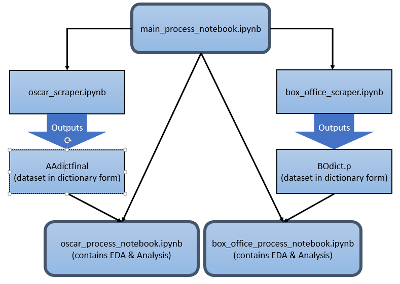

# oscar-predictor

This is an ipython notebook that walks through our process of using [IMBD](http://www.imdb.com/) data to predict the success of any given movie.

Movie success predictor written by [@dhanus](http://github.com/dhanus), [@dtomc](http://github.com/danatomc), [@rmazumdar](http://github.com/rmazumdar), &amp;  [@sbuschbach](http://github.com/sbuschbach) for a [Harvard](http://www.harvard.edu/) [Data Science](http://cs109.org) final project. We were advised by [@lfcampos](http://github.com/lfcampos).

## Getting Started

Install required python packages:
<pre><code>pip install -r requirements.txt</code></pre>

## Road Map
We did two analyses for this project: Oscar Predictor and Box Office Sales.

####Oscar Predictor
The data scraper for this analysis can be found in ipython notebook oscar_scraper.ipynb.  This takes in the xls file "Academy_Awards_2006.xls" and outputs "AAdictfinal", a dataset in dictionary form.  ("AAdict.p" can be used to skip a portion of this notebook, the output will still be "AAdictfinal") To run this data scraper run:

<pre><code>ipython notebook oscar_scraper.ipynb</code></pre>

The process notebook can be found in ipython notebook oscar_process_notebook.ipynb.  This notebook uses "AAdictfinal".  To run the analysis for the Oscar Predictor run:

<pre><code>ipython notebook oscar_process_notebook.ipynb</code></pre>

####Box Office Sales
The data scraper for this analysis can be found in ipython notebook box_office_scraper.ipynb.  This notebook outputs "BOdict", a dataset in dictionary form.  To run this:

<pre><code>ipython notebook box_office_scraper.ipynb</code></pre>

The process notebook can be found in ipython notebook oscar_process_notebook.ipynb.  This notebook uses "BOdict".  Run ipython notebook:

<pre><code>ipython notebook box_office_process_notebook.ipynb</code></pre>
